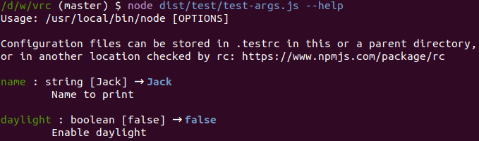

# vrc

This is a configuration loader based on [rc](https://www.npmjs.com/package/rc),
extended by argument validation and `--help`.

```js
const { Vrc } = require( 'vrc' );

const conf = new Vrc( 'myAppName', [
    { name: 'name', dflt: 'Jack', desc: 'Name to print', type: 'string' },
], { description: 'This tool solves any problem given' } ).run();

console.log( `Name: ${conf.get('name')}` );
```

**Automatic help** shows default values and actually used values.




## Configuration

`vrc( appName, conf ) : { conf, invalidNames }`

Returns the conf object from `rc` and a list of invalid names where the user supplied wrong parameters
(e.g. string instead of number). Invalid values will be replaced by their defaults. 

A configuration entry takes the following arguments:

* `name`: Name of the variable/parameter
* `desc`: Description, shown in the help
* `dflt`: Default value
* `type`: Supported values: `'string'`, `'number'`, `'boolean'`, `number[]`, `number[][]`
* `options`: Array holding valid options for the argument. Currently only for strings.

Number arrays are passed as comma-separated values and are converted; `1,3,42` results in `[1,3,42]`.


## TypeScript usage

Vrc can be used with limited typing support by passing an interface to the constructor.

```typescript
import { Vrc } from 'vrc';

interface Conf {
    balloons : number;
    colour : string;
}

const conf = new Vrc<Conf>( 'balloon', [
    { name: 'balloons', type: 'number', dflt: 99, desc: 'Number of balloons' },
    { name: 'colour', type: 'string', dflt: 'red', desc: 'Balloon colour' },
] ).run();

console.log( conf.conf.balloons ); // 99
```


## Changelog


### v2.2.0 – 2020-06-27

* Convert Numbers to string for string parameters


### v2.1.3 – 2020-05-11

* Update dependencies and correct changelog


### v2.1.2 – 2020-05-11

* Changed help output to redact user-provided secrets

### v2.1.1 – 2020-04-03

* Update minimist dependency to fix audit issue

### v2.1.0 – 2020-04-02

This version fixes the way arguments are marked as invalid and does not replace invalid user arguments
by default values anymore as this is potentially dangerous.

* Added `VrcConf.unnamedArgs` which contains positional/unnamed arguments
* Added `VrcConf.printArgs()` to print a summary of all arguments
* Added the `secr` modifier for arguments which causes them not to be printed with the above function
* **Breaking:** Invalid arguments are not replaced by default values anymore.

### v2.0.0 – 2020-03-03

* Breaking: Configuration is now created with `new Vrc()` which can be typed in TypeScript.
* Breaking: To evaluate the help parameter, use `new Vrc().run()`.
* Removed: `VrcConf.invalidNames`

### v1.11.0 – 2020-03-03

* Added: `vrc` now returns a `VrcConf` object which can e.g. check
  if an argument is using a default value or a user-provided value.
  The object is backwards compatible and still exhibits the old properties.

### v1.10.0 – 2020-03-02

* Added `options` for string parameters to define possible values

### v1.9.0 – 2020-02-10

* Changed: Long description lines are now wrapped in the help output.

### v1.8.0 – 2020-01-08

* Added support for `string[]`
