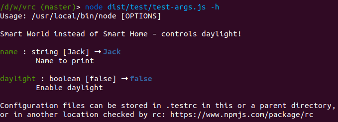

# vrc

This is a configuration loader based on [rc](https://www.npmjs.com/package/rc),
extended by argument validation and `--help`.

```js
const { vrc } = require( 'vrc' );

const conf = vrc( 'myAppName', [
    { name: 'name', dflt: 'Jack', desc: 'Name to print', type: 'string' },
] );

console.log( `Name: ${conf.name}` );
```

Automatic help generation:



## Configuration

* `name`: Name of the variable/parameter
* `desc`: Description, shown in the help
* `dflt`: Default value
* `type`: Supported values: `'string'`, `'number'`, `'boolean'`


## Using vrc in TypeScript projects

```typescript
import { vrc } from 'vrc';

const conf = vrc( … );
```
